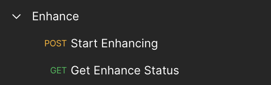

# How to Use the Dolby.io Media API Postman Collection

You can use Postman to try out the Analyze API and Enhance API. Postman is a widely used platform for API development and testing.

## You Will Need

- Postman - If you haven't already, install the Postman application [here](https://www.postman.com/downloads/).
- API Key (find this on your dashboard on the [Dolby.io website](https://dashboard.dolby.io/))
- A local audio or video file to upload

## Initial Setup for all collections

### Import Files to Postman

After installation of Postman, you need to import the JSON configuration files to complete the Postman collection setup.

1. Download the directory `postman/collections`

   > If you wish, you can also individually download the other collection JSON files. If this is the case be sure to also download the `Media_API_Test.postman_environment.json`

2. Open Postman and select "File -> Import" and select "Folder" -> "Choose Folder on Your Computer"

3. Find and select the folder `enhance`. You should see a window confirming your import of the collections and API set up. Select "Import".

4. You should now see the Enhance collection appear in your workspace on the left

### Set Up Environment

1. In the top-right corner, click on the "No Environment" dropdown and select "Media_API_Test"

2. Click on the sliding icon to the right of the "Environment" drop down and select "Manage Environments"

3. Click directly on the "Media_API_Test" name

4. Input your API Key in both the "Initial Value" and "Current Value" boxes. Additionally, if you already have an input file URL, you can enter it here. All other settings can be kept as-is. Click "Update" on the bottom right.

5. Close out of the Manage Environments window to complete environment setup.

### The Postman Collection for the API you wish to test:
  - [Collections](collections)
  - [Analyze Collection Tutorial](docs/How-to-Use-Analyze-Collection.md)
  - [Enhance Collection Tutorial](docs/How-to-Use-Enhance-Collection.md)
  - [Transcode Collection Tutorial](docs/How-to-Use-Enhance-Collection.md)
  - [I/O Collection Tutorial](docs/How-to-Use-Enhance-Collection.md)
  - [Platform Collection Tutorial](docs/How-to-Use-Platform-Collection.md)