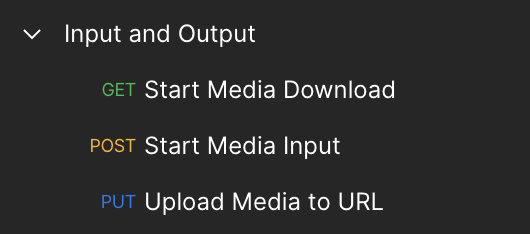
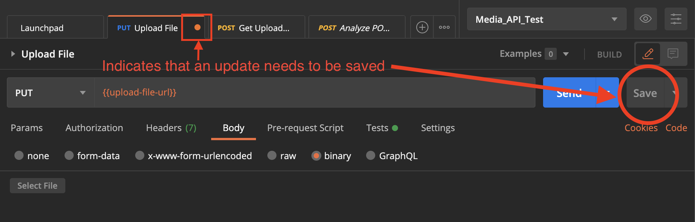
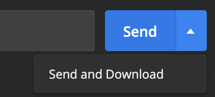
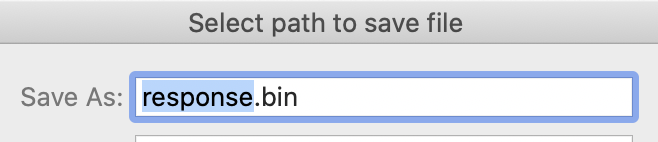

# How to Use the I/O API Postman Collection

You can use Postman to try out the Input and Output API. Postman is a widely used platform for API development and testing.

## You Will Need

- Postman - If you haven't already, install the Postman application [here](https://www.postman.com/downloads/).
- API Key (find this on your dashboard on the [Dolby.io website](https://dolby.io/))
- A local audio file to upload

### Get Upload URL

If you are using a non-publicly accessible file, you will want to upload the file to temporary Dolby storage instead.

1. Click on the "Input and Output" Collection on the left. The three requests are listed in order.

2. Click on "Start Media Input"

3. Click the **"Send"** button on the right-hand side of the above image to send a request to receive an **Upload URL** for your input file.

> The Upload URL is a url that your file will be uploaded to temporarily. Learn more on the [Dolby.io docs](https://dolby.io/developers/media-processing/tutorials/media-input-and-output#dolby-media-input).

- If you receive a `401` Unauthorized Error, make sure your API key is correct.
- If the call is successful, the return status will be `200 OK` and you will see a URL in the response body window. Move onto "Upload File"

### Upload File

1. Click on "Upload Media to URL"

> This step is a PUT call that will upload a local file to the URL received in the previous step

2. Select the "Body Tab", then click "Select File"

3. Select an audio file from your local files to upload

4. Make sure to keep the type selected in Postman as "binary"

5. Click "Save" on the far right to persist your file uploaded to Postman

6. Click **"Send"** to upload your file to the URL received in the "Get Upload URL" step

- If you see an error of "Could not get any response", make sure the "Get Upload URL" step was completed correctly & you have received a valid return URL

- If the call is successful, the return status will be `200 OK` and you will see a blank response in the response body window. Move onto "Analyze POST"

Now you can use the `dlb://` url you created for further Dolby.io API calls!

### Downloading the Output File

1. Click the "Start Media Download" Request

2. _Instead_ of clicking "Send", click on the arrow to the right of "Send", then select **"Send and Download"** from the dropdown

3. If the request is successful, a Save File window will open in your file manager

4. The default file extenstion is `*.bin`, so make sure to manually assign the same file extension as your uploaded input file (ex: change "response.bin" to  "enhanced_sample_file.wav")

5. You can now open your process file wherever you saved it in your file system and hear the playback