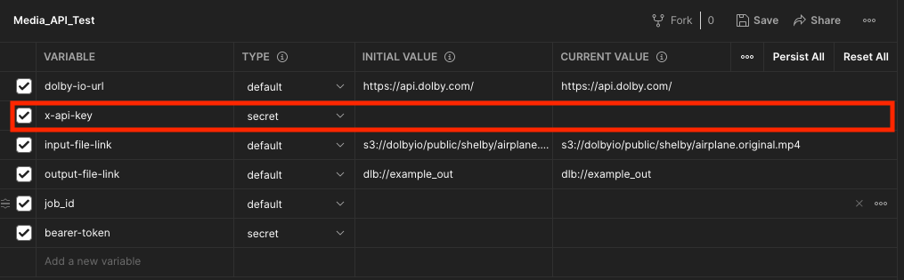

# How to Use the Transcode API Postman Collection

You can use Postman to try out the Transcode API. Postman is a widely used platform for API development and testing.

## You Will Need

- Postman - If you haven't already, install the Postman application [here](https://www.postman.com/downloads/).
- API Key (find this on your dashboard on the [Dolby.io website](https://dolby.io/))
- A local audio file to upload

## Setup

### Import Files to Postman

After installation of Postman, you need to import the JSON configuration files to complete the Postman collection setup.

1. Download the directory `postman/collections`

   > If you wish, you can also individually download the other collection JSON files. If this is the case be sure to also download the `Media_API_Test.postman_environment.json`

2. Open Postman and select "File -> Import" and select "Folder" -> "Choose Folder on Your Computer"


3. Find and select the folder `enhance`. You should see a window confirming your import of the collections and API set up. Select "Import".


4. You should now see the Enhance collection appear in your workspace on the left


### Set Up Environment

1. In the top-right corner, click on the "No Environment" dropdown and select "Media_API_Test"


2. Click on the sliding icon to the right of the "Environment" drop down and select "Manage Environments"


3. Click directly on the "Media_API_Test" name


4. Input your API Key in both the "Initial Value" and "Current Value" boxes. All other settings can be kept as-is. Click "Update" on the bottom right.



5. Close out of the Manage Environments window to complete environment setup.

## Running the Enhance API

This will walk you through the steps of calling the Enhance API.

### Get Upload URL

1. Click on the "Enhance" Collection on the left. The five requests are listed in order.


2. Click on "POST Get Upload URL"

3. Click the **"Send"** button on the right-hand side of the above image to send a request to receive an **Upload URL** for your input file.

> The Upload URL is a url that your file will be uploaded to temporarily. Learn more on the [Dolby.io docs](https://dolby.io/developers/media-processing/tutorials/media-input-and-output#dolby-media-input).

- If you receive a `401` Unauthorized Error, make sure your API key is correct.
- If the call is successful, the return status will be `200 OK` and you will see a URL in the response body window. Move onto "Upload File"

### Upload File

1. Click on "PUT Upload File"

> This step is a PUT call that will upload a local file to the URL received in the previous step

2. Select the "Body Tab", then click "Select File"

3. Select an audio file from your local files to upload

4. Make sure to keep the type selected in Postman as "binary"

5. Click "Save" on the far right to persist your file uploaded to Postman


6. Click **"Send"** to upload your file to the URL received in the "Get Upload URL" step

- If you see an error of "Could not get any response", make sure the "Get Upload URL" step was completed correctly & you have received a valid return URL

- If the call is successful, the return status will be `200 OK` and you will see a blank response in the response body window. Move onto "Enhance POST"

### Enhance POST

> This is the call that will initiate the enhancement of your uploaded file.

> If you wish you can utilize the [API Documentation on Dolby.io](https://dolby.io/developers/media-processing/api-reference/analyze) to change the parameters

1. Click the **"Send"** button to start the enhancement of your file

- If you receive an error message, make sure the previous steps were completed correctly & that you have a valid request Body.
- If the call is successful, the return status will be `200 OK` and you will see a `job_id` returned in the response body window. Move onto "Enhance GET Result"

### Enhance GET Result

> This GET call will poll the returned `job_id` from the previous step to check the job status. Once the job is complete & successful, the response body will contain the JSON results of the file analysis.

1. In this last request, simply click the **"Send"** button again to poll the status of the job kicked-off in the previous step. If the job is not yet complete, you will see the following in the response body:

_Example Response for Job in Progress_

```
{
    "path": "/media/enhance",
    "status": "Running",
    "progress": <Progress_Value>,
    "api_version": <API_Version>
}
```

- If you receive an error, check the received error code against the reference listed in the API docs.

### Downloading the Output File

1. Click the GET Download Output Request

2. _Instead_ of clicking "Send", click on the arrow to the right of "Send", then select **"Send and Download"** from the dropdown


3. If the request is successful, a Save File window will open in your file manager

4. The default file extenstion is `*.bin`, so make sure to manually assign the same file extension as your uploaded input file (ex: change "response.bin" to  "enhanced_sample_file.wav")


5. You can now open your process file wherever you saved it in your file system and hear the playback
